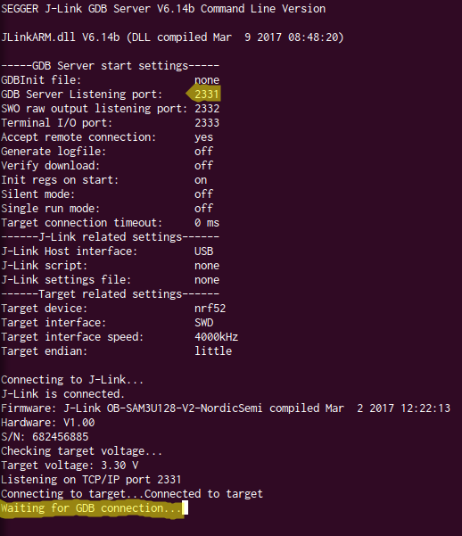
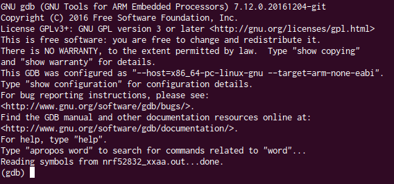
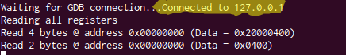
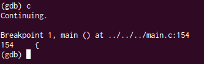

개발을 하다보면 소프트웨어가 이유없이 죽거나, 멈춰저 있는 경우가 발생을 합니다. 이런경우 print문을 찍거나 디버거를 실행해 디버깅을 할 수 있습니다.

임베디드 개발에서 이런일이 일어난다면 어떻게 해야 할까요?<br>
print문을 사용할 수 있습니다. 하지만 프로그램을 실행하려면 보드에 다운로드 하는 시간이 있어 비효율적이입니다. 그리고, 로그를 볼 수 없는 개발 환경일 수도 있습니다.

하지만, JTAG 장비만 있다면 임베디드 환경에서 디버거를 사용해 효율적으로 디버깅을 할 수 있습니다.

## 전체 구성도


개발에 사용하는 타겟보드가 "ARM"이고, HOST PC에는 "GDB Server"와 "GDB Client" 두 프로그램이 실행중입니다. J-Link(JTAG)장비가 PC와 타겟보드를 연결하고 있습니다.

JTAG은 하드웨어 디버거로 CPU의 동작과는 상관없이 타겟보드의 레지스터, 메모리를 읽을 수 있습니다.<br>
GDB Server는 리모트 디버깅을 가능하게 해주는 서버이고, GDB Client와 TCP/IP로 연결됩니다.<br>
GDB Client는 gdb, ddd, eclipse를 사용할 수 있으며, 저는 gdb를 사용합니다.

## 환경설정
##### 환경설정은 nRF52-DK보드, ubuntu 16.04 기준으로 작성되었습니다.

- ARM GDB 설치(GDB Client)
```bash
$ sudo add-apt-repository ppa:team-gcc-arm-embedded/ppa
$ sudo apt-get update
$ sudo apt-get install gcc-arm-embedded
```

- J-Link Tool 설치(GDB Server) <br>
[SEGGER JLINK 다운로드](https://www.segger.com/downloads/jlink)페이지에서 <br>"J-Link Software and Documentation Pack"을 설치하기시 바랍니다.

- Compiler 옵션 추가하여 빌드 <br>
Makefile에 아래 컴파일 옵션을 추가해 디버깅 심볼을 생성합니다.
```
CFLAGS += -ggdb  #디버깅 옵션 추가
CFLAGS += -O0    #최적화 안함
```

- GDB Server 실행
```
$ JLinkGDBServer -device nrf52 -ir -select USB  -if swd -speed 4000
```
JLinkGDBServer를 실행시키면 Server는 2331포트를 Listen하고 있으며, Client가 접속하기를 기다리고 있습니다.


- GDB Client 실행
```
$ arm-none-eabi-gdb COMPILED_FILE.out
```
GDB가 정상적으로 실행되면 아래 메시지가 출력됩니다.
<br>
이 상태는 GDB Client가 실행이 된 상태이며 GDB Server에 접속한 상태는 아닙니다.<br>
GDB Shell에서 아래 명령어를 입력하여 GDB Server에 접속합니다.
```
(gdb) target remote localhost:2331
```
정상연결이 되면 GDB Server에 "Connected" 메시지가 나옵니다.


## 디버깅
디버거를 띄웠으니 본격적으로 디버깅을 할 차례입니다.<br>
디버깅을 하기 위해 필요한 GDB 명령어를 알아봅시다.괄호 안은 단축키입니다.<br>
- breakpoint(b) : 브레이크 포인트 설정
  - breakpoint main : main 함수에 브레이크 포인트 설정
  - breakpoint main.c:233 : main.c의 233줄에 브레이크 포인트 설정
- info breakpoint : 설정된 브레이크 포인트 리스트 보여주기
- next(n) : 다음 줄까지 실행
- step(s) : 함수 안으로 따라가기
- backtrace(bt) : 함수 호출 순서 출력
- load : 실행중인 프로그램 불러오기
- mon : 리모트 타겟으로 명령어 전송
- continue(c) : 프로그램 계속 실행
- print(p) : 변수나 메모리 출력

디버깅 심볼이 포함된 파일을 불러온 후 타겟보드를 리셋시키고, main함수에 브레이크 포인트를 잡습니다.
```
(gdb) load
(gdb) mon reset
(gdb) break main
```

그리고 프로그램을 계속 실행시키면 main함수에 브레이크포인트가 잡히는 것을 확인할 수 있습니다.
```
(gdb) continue
```


## 마무리
이처럼 JTAG과 GDB Server, GDB Client을 이용하면 임베디드 개발에서도 쉽게 디버깅을 할 수 있습니다.<br>

uart로 출력되는 print문에 의존하지 마시고 여러분도 GDB를 이용해보는게 어떨까요?
